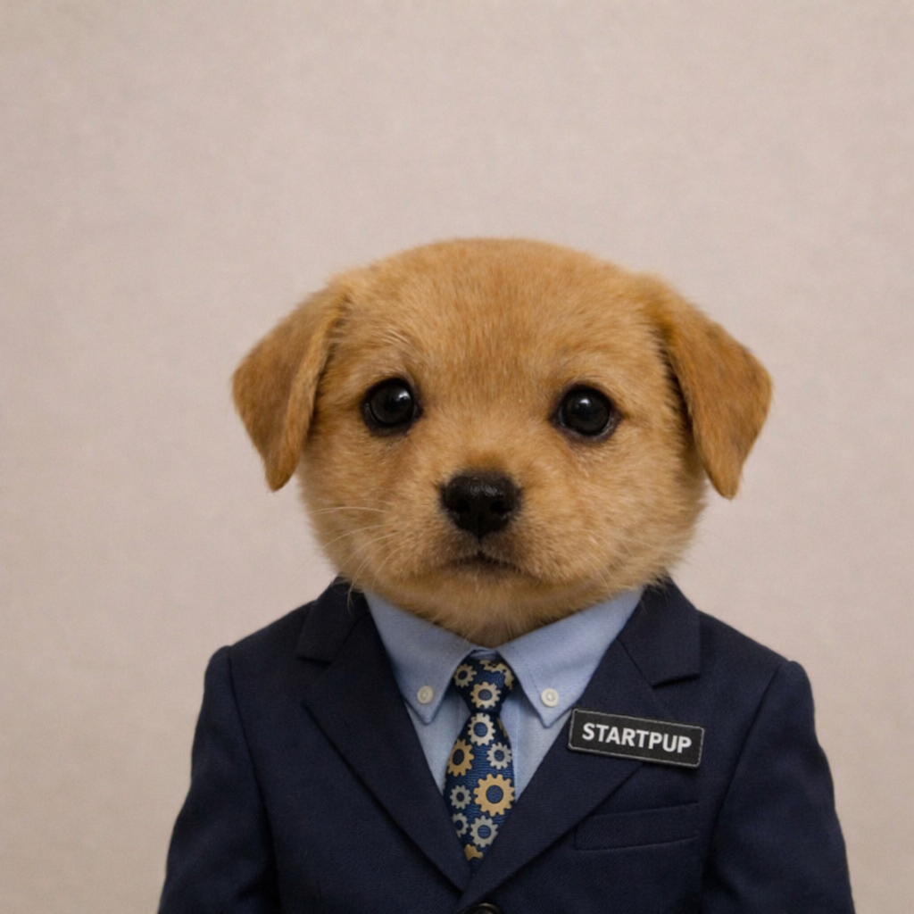

  

<h1 align="center">STARTPUP WHITEPAPER</h1>

  <b>The startup puppy with no intrinsic value, just like everything else humans decided mattered. EVQdojyuNeGbJwqv74N4e4MtnbeWmV3zU17SKRMApump</b>

  1B Max Supply • Deflationary • Buybacks & Burns • Built on belief

---

## What is STARTPUP?

**STARTPUP** is a memecoin built around one simple truth:

**value is not discovered, it is assigned.**

Paper money is paper.  
Gold is a shiny metal.  
Silver is another metal.  
Oil is black liquid in the ground.  

On their own, none of these things come stamped with universal meaning.

Humans gave them meaning.  
Humans gave them trust.  
Humans gave them value.

The U.S. dollar has value because people collectively agree it does.  
Gold has value because civilizations, markets, and culture decided it does.  
Silver, oil, stocks, real estate, art, diamonds, even digital numbers in bank accounts, all rely on the same invisible engine:

## **collective belief**

That is the entire thesis behind **STARTPUP**.

It has **no intrinsic value**.  
And that is exactly the point.

Because neither does money itself.

---

## The Thesis

People love saying memecoins have "no intrinsic value" as if that ends the conversation.

But if you zoom out, that same argument hits almost everything humans treat as valuable.

### Ask the real question:
Why does paper money have value?

Because governments said so?  
Because economies use it?  
Because people trust it?  
Because everyone agrees to treat it as money?

Exactly.

Now ask:

Why does gold have value?  
Why does silver have value?  
Why does oil have value?  
Why do collectibles have value?  
Why do luxury brands have value?  
Why do stocks trade far above book value?  
Why do digital assets hold multi-billion dollar market caps?

The answer is always some combination of:

- scarcity
- utility
- narrative
- trust
- social coordination
- belief

**STARTPUP lives in that exact same world.**

Not the world of "intrinsic value."

The world of **human value assignment**.

---

## Why STARTPUP Matters

STARTPUP is more than just a meme.

It is a tokenized reflection of one of the biggest truths in finance:

> Humans decide what matters.  
> Markets price belief.  
> Scarcity amplifies it.

If enough people decide STARTPUP matters, then it matters.  
That is how value works everywhere.

Not just in crypto.  
In society.

---

## Tokenomics

### Max Supply
**1,000,000,000 STARTPUP**

That is it.  
No infinite printing.  
No central bank.  
No surprise supply expansion.

### Deflationary Design
STARTPUP is designed to become scarcer over time through:

- **Pump.fun agent buybacks**
- **token burns**
- **permanent supply reduction**

As tokens are bought back and burned, the circulating supply decreases.

That means STARTPUP does something most fiat currencies do not:

## **it gets harder, not easier, to find over time**

---

## Why Deflation Matters

The dollar can be printed.  
Gold supply can still be mined.  
Silver supply can still be mined.  
Oil supply can still be drilled.  

But STARTPUP has a hard cap of **1B**, and with buybacks and burns, its effective available supply can shrink.

That gives STARTPUP a scarcity profile that is, in one very real sense, stronger than many traditional assets:

- **Dollar:** inflationary  
- **Gold:** expanding supply through mining  
- **Silver:** expanding supply through mining  
- **Oil:** extracted continuously  
- **STARTPUP:** fixed max supply + burns

So if humans decide that scarcity, meme power, community energy, and belief are enough to create value, then STARTPUP can become more than a joke.

It can become a proof of concept for the idea that:

## **belief + scarcity = value**

That is not crazy.

That is literally how markets already work.

---

## Buybacks & Burns

STARTPUP is not just static supply sitting there forever.

A **Pump.fun agent** will perform:

- strategic buybacks
- token burns
- ongoing supply reduction mechanics

Every burn removes tokens from circulation permanently.

This means the asset becomes more scarce over time, rewarding long-term conviction and reinforcing the narrative that **the less there is, the more every unit can matter**.

In a world where most currencies lose purchasing power over time, STARTPUP aims to become rarer.

---

## No Intrinsic Value. Full Transparency.

Let us be honest from day one:

**STARTPUP has no intrinsic value.**

But neither does a piece of paper with ink on it unless society agrees it does.  
Neither does a metal rock unless humans culturally and economically coordinate around it.  
Neither does a number on a screen unless a system backs it with trust.

STARTPUP is transparent about the game.

It is not pretending to be something it is not.

It is a memecoin built on:
- narrative
- scarcity
- belief
- internet culture
- market psychology
- collective agreement

That is more honest than most systems.

---

## The Philosophy of STARTPUP

STARTPUP asks a simple but uncomfortable question:

### What is value, really?

Is value physical?  
Is it measurable?  
Is it objective?  
Or is it mostly social?

If billions of people accept paper as money, it becomes money.  
If millions of people accept gold as a store of value, it becomes one.  
If markets accept oil as critical, it gets priced accordingly.  
If communities accept a memecoin as meaningful, liquid, scarce, and culturally powerful, it can also hold value.

Not because nature declared it.

Because humans did.

STARTPUP is a meme wrapped around a financial truth:
**the market is a machine that prices consensus.**

---

## Why the Puppy?

Because finance takes itself too seriously.

And because sometimes the cleanest way to explain the system is with a puppy in a suit.

STARTPUP represents:

- ambition
- internet-native branding
- humor
- startup energy
- belief-driven markets
- the absurdity of value itself

Cute face.  
Serious thesis.

---

## Core Message

**STARTPUP is not valuable because it has intrinsic value.**  
**STARTPUP can be valuable because humans choose to value it.**

That is the same force that powers:

- fiat currencies
- commodities
- collectibles
- luxury goods
- equities
- brands
- memes
- entire financial systems

The difference is that STARTPUP is honest about it.

---

## Final Thought

The world runs on shared stories.

Money is a story.  
Gold is a story.  
Markets are stories.  
Brands are stories.  
Nations are stories.  

STARTPUP is a story too.

A puppy in a suit.  
A fixed supply.  
A deflationary path.  
A meme with a sharper thesis than most assets people already believe in.

If people decide STARTPUP matters, then it matters.

And that has always been how value works.

---

## Disclaimer

STARTPUP is a memecoin for entertainment, culture, and community purposes. It does not represent equity, ownership, or a claim on real-world assets. Nothing in this repository is financial advice. Always do your own research.

---

  <b>STARTPUP</b> 
  Built on belief. Sharpened by scarcity.

